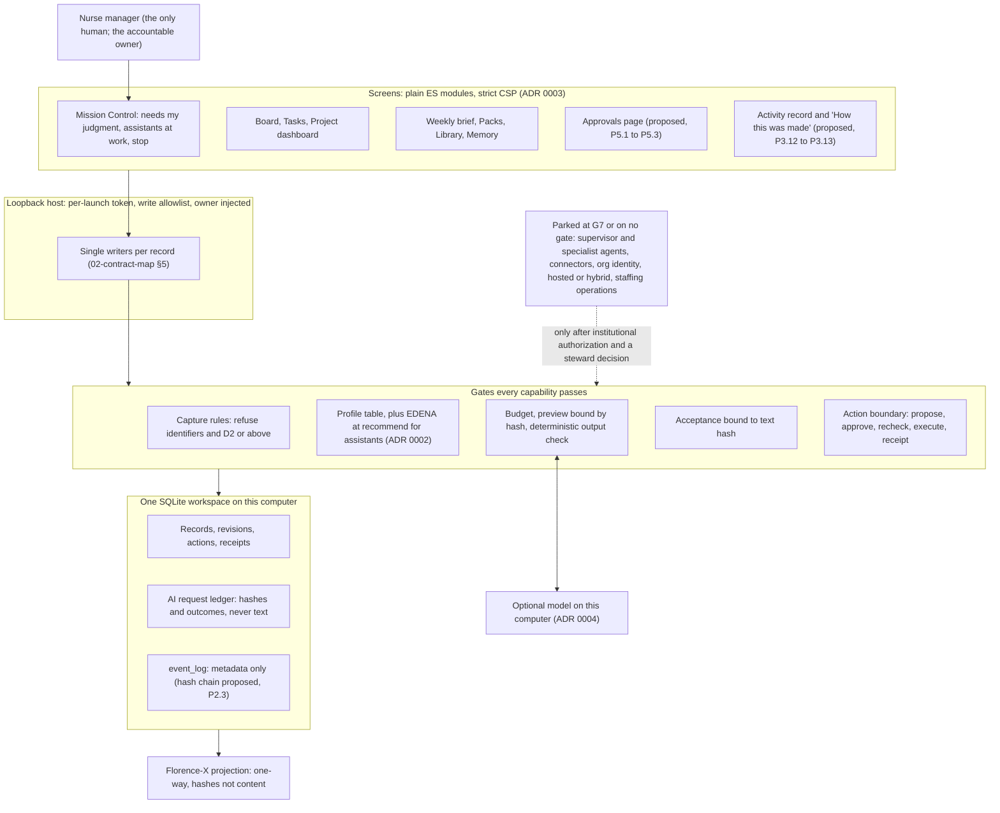

# Architecture direction and build plan improvements

Five research notes propose a "Nurse AI OS Architecture v2.0". They describe
a supervisor with six specialist agents, a "Hermes Control Plane"
dashboard, and a JARVIS-style mission control. This document checks each
concept they contain against this repository and its binding rules. It then
states which concepts change the Manager Edition's direction, and how the
build plan should absorb them.

**Verdict.** The notes describe a cloud-hosted, multi-agent control plane.
The Manager Edition is a local, single-assistant app with no model by
default. About a fifth of what the notes ask for already exists here, under
other names. Most of the rest fits once it is reshaped to the accepted
ADRs: governed approvals, evidence, a home screen that shows what needs
attention, and stop controls. A small set conflicts with binding rules and
is not adopted. The most valuable result of the review is not a new layer.
It is five gaps in what already ships (§2). The most serious is that a
manager who starts their own workspace cannot add any work to it.

Of the 70 concepts in the notes:

| Verdict | Count | Meaning |
|---|---|---|
| Already have | 14 | The repository does this today, often under another name |
| Adapt | 42 | Keep the intent, change the shape to fit the ADRs and `SAFETY.md` |
| Defer | 8 | Valid, but behind G7 or a steward decision that has not been made |
| Reject | 6 | Conflicts with a binding rule, or is unsound here |
| Adopt as written | 0 | None survives unchanged |

## 1. Sources and method

The five notes, as supplied:

| Note | Concept ids | What it proposes |
|---|---|---|
| "A formal Nurse AI OS Architecture v2.0 document…" | ARCH-01 to ARCH-21 | Supervisor plus six specialist agents, critic, escalation manager, knowledge and memory layers, MCP connectors, governance plane, six phases over twelve months |
| "Draft the UI component tree for the dashboard" | UI-01 to UI-13 | A React/Next.js component tree for a "Hermes Control Plane" |
| "What are best in class hermes dashboard setups…" | PRD-NAME, PRD-01 to PRD-18, PRD-SCREENS, PRD-IA, PRD-DESIGN, PRD-BOUNDARY, PRD-METRICS, PRD-MVP | Product requirements for the same dashboard |
| "How do open-source JARVIS Mission Control setups work" | MC-01 to MC-07 | A file-backed shared state, a lead-coordinator persona, and a real-time dashboard |
| "Research … their Agentic OS system, Jarvis, and mission control" | SK-01 to SK-04 | A paid community's system. Its public material is gated and unverifiable |

**Method.** Six readers mapped the subsystems:

- the Manager Edition core
- its renderer and IPC contract
- `naio-integrations`
- `naio-harness-v2`
- the Mission Control lineage in `naio-os/`
- the binding policy files and prior architecture documents

Nine analysts then gave each concept a verdict and proposed one-PR build
steps. Two adversarial verifiers checked each analyst's work. One checked
every repository claim against the code. The other checked every proposal
against `SAFETY.md`, `GOVERNANCE.md`, `TRADEMARKS.md`, ADRs 0001–0004, the
validation report's corrections, and the step 0.8 review. A reconciler
applied their 187 accepted corrections. A final critic checked coverage,
duplicate steps, and sequencing. The findings in §2 were then re-checked by
hand at the lines cited.

## 2. What the review found in today's code

These are facts about the repository at the commit this document lands on.
Each one is a gap in shipped work, not a new feature.

1. **An own workspace cannot gain work.**
   - The writers for projects, tasks, decisions, and priorities exist
     (`ManagerWorkspace.add_project`, `add_task`, `move_task`, `set_blocked`,
     `set_paused`, `complete_task`, `record_decision`, `set_priorities`;
     `src/nurse_manager/services.py:147-320`).
   - No CLI command, IPC command, or app write calls them
     (`contracts/ipc/commands.json`; `WRITE_COMMANDS` at
     `src/nurse_manager/app.py:65-72`). Only `sample.py` does.
   - So "Start your own workspace" leads to a board the manager cannot
     fill. Every MVP outcome and every measure depends on closing this.
2. **The audit stream is not tamper-evident.**
   - `event_log` has no hash chain and no append-only enforcement
     (`migrations/0001_initial.sql:157`; `Store.log` at `store.py:296-301`).
   - It is written in the same transaction as each change, so it already
     fails closed.
   - `SAFETY.md:36` requires tamper-evident audit for official
     deployments. Shipping the signed release candidate (step 6.1) without
     a chain would knowingly miss that clause.
3. **Approvals exist only on the command line.**
   - Mission Control lists "Approval needed" items
     (`src/nurse_manager/views.py:230-232`).
   - `approve`, `run`, and `export` are not app writes. The support guide
     says the screens never write export files (`docs/04-support-guide.md:155`).
   - ADR 0003 promises no terminal. Before any second path is added, the
     action status checks must move inside the write. Today `approve` and
     `execute` read the status (`actions.py:250`, `:281`) before opening the
     write transaction (`:265`, `:295`). `_set_status` updates by id alone
     (`:381-386`).
4. **What the assistant was told is not versioned.**
   - The two system prompts are unversioned constants (`assistant.py:95`,
     `:104`). The preview hash covers them per request, but nothing names a
     version.
   - The Florence-X `EvidenceBundle` always reports `model_used`,
     `model_version`, and `prompt_template_version` as empty
     (`florence_adapter.py:273-276`).
5. **Safety state depends on which screen loaded.**
   - The sample banner is set only from envelopes that carry a `sample`
     field (`renderer/app.mjs:263`). `WeeklyBrief` and `AssistantStatus`
     have none, so a direct load of the brief or AI pages cannot show it.
   - One badge kind, `blocked`, is used for a blocked task, the manager's
     own "Stopped", "Waiting", "Will not be sent", and "Delete for good?"
     (`renderer/views.mjs:145`, `:310`, `:964`, `:1252`, `:1368`).

Smaller verified defects, each taken into a step in §5:

- `move_task` changes the status of a completed task without clearing its
  completion evidence (`services.py:199-237`).
- `connect_local` forces a monthly budget of zero (`assistant.py:335`), so
  the budget gate has nothing to govern for the only shipped provider.
- The record-writer register does not list `action_policy_versions`,
  `pilot_feedback`, or `pilot_feedback_exports` (`02-contract-map.md` §5).
- `02-contract-map.md:15` still says "this PR".
- `02-contract-map.md:134` says mission lifecycle moves to Florence-X
  "once G2 step 2.11 lands". 2.11 shipped as a one-way adapter only.

One finding sits outside the Manager Edition. The shared EDENA engine
allows a zone migration when `zone_migration_approval` holds any non-empty
value (`naio-integrations/src/naio_integrations/policy.py:92`). Its own test
asserts that an invented id is allowed
(`naio-integrations/tests/test_data_zones.py:96-106`). The `approval_id`
path, by contrast, checks the actor's held approvals (`policy.py:278`).
This changes Integration Contract behavior, so it needs a GOVERNANCE §3
proposal (step N-1 in §5.4).

## 3. The architecture as it stands, and where the notes land

How the v2.0 components land, in one line each:

| v2.0 component | In the Manager Edition |
|---|---|
| Nurse Manager Workspace | Mission Control and the existing screens. Huddles, coaching, and communications are packs. Staffing and quality operations are G7 |
| Request Router | The manager picks the workflow on screen. A deterministic refusal set runs before any AI preview (P4.3) |
| Session and Task State | Per-mechanism state machines that already exist. Resume means re-verify, never re-run |
| Supervisor Agent | Not in the Manager core, on any gate. Florence-X, after evidence and a steward decision |
| Specialist Agents | One reviewed assistant task manifest with versioned prompts (P4.1). No Staffing or Quality & Safety tasks in the Personal profile |
| Critic / Verifier | Already built as a deterministic output check. It gains a pinned regression and red-team set (P4.2). A model critic may only add warnings |
| Escalation Manager | "Needs my judgment" with a reason, or an honest hand-off out of the app. A second reviewer is G7 |
| Approved Knowledge Base | Sources stay references with review dates the manager maintains (P3.11). Employer policy libraries are G7 |
| Organization / Session Memory | Organization memory is G7. There is no hidden session memory; continuity comes only from what the manager accepted |
| Audit and Evidence Ledger | `event_log` plus receipts and Florence-X bundles. It becomes tamper-evident (P2.3), never called "immutable" |
| Tools and Connectors (MCP) | None in the Personal profile. An admission contract is a G7 design item |
| Identity, RBAC/ABAC | One owner plus a distinct assistant identity until G7 |
| Data classification, minimum-necessary retrieval | Already built as refusal at capture and "only this project, exactly as previewed" |
| Human approval gates | Already built and hash-bound. They gain an in-app path (P5.1 to P5.3) |
| Observability | Local facts the manager pulls. Nothing leaves the computer |
| Nurse Ethics Control Plane | A rules and operating-boundary register held to the code by a test (P5.4). "Control plane" stays EDENA's term |

## 4. Direction: ten decisions

These are the direction statements this document asks the steward to
adopt. Decisions 1, 5, 6, and 9 are recorded together in the proposed ADR
0005 (`adr/0005-scope-against-v2-concept-notes.md`).

1. **One human-orchestrated, single-assistant system.**
   - The notes' supervisor, router agent, six specialists, coordinator
     persona, agent-written shared memory, and agent registry are not built
     into the Manager core.
   - They become three things: the manager's explicit choice of workflow,
     reviewed task entries in one assistant manifest, and reviewed packs.
   - Any multi-step orchestration is Florence-X work, after it is evidenced
     and the steward decides (ADR 0001; `three-lanes/STRATEGY.md:151`
     defers "more generalized agents, agent swarms").
2. **Every new capability passes the gates the code already enforces:**
   - capture-time refusal, not redaction
   - a byte-exact preview bound by hash
   - EDENA at `recommend`
   - budgets
   - a deterministic line-by-line citation check
   - owner acceptance bound to the text hash
   - for effects: propose → approve bound to hash and destination →
     recheck → receipt

   No model ever assigns risk, picks a workflow, releases text, or holds a
   gate.
3. **Close the real-manager gaps before adding surfaces.** In order:
   - wire the existing writers to commands and screens
   - decide every status transition inside its write
   - give governed actions an in-app path, with reject and revoke, if the
     steward agrees
   - let the weekly brief be edited as a stale-checked new draft that
     keeps its AI label
4. **Audit becomes tamper-evident, never "immutable".**
   - One SHA-256 chain on `event_log`, written in the writer's transaction.
     It reuses the canonical-hash discipline of the gateway tracer and the
     harness provenance ledger.
   - The chain is a named prerequisite of step 6.1.
   - Until it lands, every view and document says the local log is not
     tamper-evident.
5. **The boundary is D0/D1. It is stated, held by tests, and never
   certified.**
   - One register maps each rule to its enforcing code and test, and lists
     what is admitted, refused, and G7-only.
   - A header strip on every screen states the data rule as an instruction,
     plus "names are not detected".
   - No surface says "No PHI", "Production", "immutable", or "compliant".
6. **Organizational scope is parked, and named so.**
   - G7 becomes a parked-scope register (§5.5) with a header that says
     `SAFETY.md` §2–3 apply unchanged. This covers anything that needs:
     - D2 or higher data
     - a second person or an organization identity
     - connectors
     - a hosted or hybrid surface
     - customer-cloud deployment or a BAA
     - role-based views, a risk register, or incidents
   - Rejected for the Personal profile, not deferred:
     - staffing and coverage operations
     - quality and safety event review
     - coaching notes about named individuals
     - measuring people by unit, shift, or role
7. **Anything that governs runtime behavior carries a version, and records
   name it.**
   - This covers system prompts, the profile table, the EDENA policy,
     privacy recognizers, and packs.
   - CI forces a version bump when content changes. A widening change links
     a steward decision.
8. **Measurement follows `three-lanes/EVIDENCE.md`, not the notes' KPI
   table.**
   - Facts are counted locally. They are shown only to the manager, as
     counts or "N of M", never as scores, and never segmented by person
     (`EVIDENCE.md:103`).
   - Anything that leaves the computer goes through an opt-in, previewed
     pilot export after a steward decision.
9. **Naming and design stay calm and plain.**
   - The product is "Nurse AI OS Manager". "Hermes Control Plane", "Ask
     Hermes", "Jarvis", and "control plane" never name a Manager Edition
     surface (`05-hermes-review.md` §2.3), and a guard test enforces it.
   - The renderer stays framework-free ES modules. The notes' React/Next.js
     tree is not adopted.
   - Status meaning becomes declared data. A critical color is reserved for
     "denied" and "failed", and only after the overloaded `blocked` kind is
     split.
10. **Gates pass by go/no-go, never by month.**
    - The notes' six phases are mapped onto gates or marked "deferred: on no
      gate" (§5.6).
    - The pilot is gated by signing and clean-machine install, not by
      feature count.
    - Steward decisions are batched into a few proposal issues (§6), so the
      blocked critical path is not buried under new work.

## 5. Build plan improvements

### 5.1 The critical path does not change

The pilot is still gated by code signing:

- 0.9: signing identities
- 1.9: signing
- 1.10: clean-machine install on real manager laptops
- 6.1: signed release candidate

All four are blocked on the steward's accounts. Nothing below unblocks
them, so they should be requested now if they have not been. This document
adds named **prerequisites to 6.1's row**:

- the audit chain (P2.3)
- capture from the screens (P3.1, P3.2)
- the status strip with its unsigned-build label (P3.6)
- the security facts sheet (P6.1)

### 5.2 Minimal pilot-ready subset, in order

The full list in §5.4 has about 55 steps. Most are post-pilot. These are
the steps a real manager's pilot needs, in build order:

1. P1.1: complete and test the record-writer register. It lands before any
   new migration.
2. P2.1: task transitions decided inside the write.
3. P2.2: capture commands.
4. P3.1, P3.2: capture screens.
5. P2.3: tamper-evident `event_log`.
6. P2.4: conditional action transitions.
7. P3.6: header status strip, with the global stop.
8. P3.7: actionable "Needs my judgment".
9. P5.1: the Approvals page (read). P5.2 and P5.3 follow if the steward
   decides the app may approve.
10. P6.1: security and data-handling facts.
11. P6.8: support-guide additions.

### 5.3 How the new steps enter 01-build-steps.md

- Ids here are provisional (`P` + gate + number). Final step and migration
  numbers are assigned once, when the steward accepts a step into
  `01-build-steps.md`. This avoids the collisions the review found when
  several areas each claimed "3.8" or "migration 0014".
- G1, G2, and G3 have every existing step done. Steps added there are
  marked **post-gate additions**, so they do not quietly reopen a go/no-go
  the steward may already have given.
- Column additions to `assistant_requests` (prompt version, refusal
  category, a `refused_intake` outcome) go into **one** migration. They
  follow the 0010/0011 pattern: rebuild, keep every row, and back up first.
- Every new write command gets the same protections: POST only, body
  checked, owner injected, read-only on the dev host, named in the support
  guide, and present in the generated types. P1.3 enforces this for every
  entry in `WRITE_COMMANDS`.

### 5.4 Proposed steps by gate

Legend for the **Steward** column: **D**, needs a steward decision first
(the issue it belongs to is in §6); **—**, buildable now; **⛔**, also
blocked on an existing blocked step (named). Test files and test classes
named in an exit check are new unless they already exist in
`nurse-manager/tests/` or the named package.

**G0: baseline and decisions**

| Id | Step | Exit check | Steward |
|---|---|---|---|
| P0.1 | ADR 0005: Manager Edition scope against the v2.0 concept notes (proposed in this PR) | ADR status Accepted with a decision record, following ADRs 0001–0004 | D (I-1) |
| P0.2 | Map the notes' six phases onto the gates in `01-build-steps.md`, and fix stale status lines there and in the README | Every phase has a gate or "deferred: on no gate"; `test_support_guide.py` still passes | — |
| P0.3 | Open the steward decision issues in §6 and link them from `01-build-steps.md` | Issues exist; each blocked step names its issue | D |
| P0.4 | Obtain or re-author the 2.10 definitions (concern, containment, preservation hold) | A definitions document the steward accepts; 2.10 becomes buildable | D (I-3) |
| P0.5 | Guard the Manager Edition against Hermes or persona names in product positions | `ManagerEditionNamingTests` in `test_notices.py`: passes now, fails on a seeded "Ask Hermes" or "Hermes Control Plane" string, passes on "runs on Hermes Desktop" | — |

**G1: contracts (post-gate additions)**

| Id | Step | Exit check | Steward |
|---|---|---|---|
| P1.1 | Complete the record-writer register (`action_policy_versions`, `pilot_feedback`, `pilot_feedback_exports`); correct `02-contract-map.md:15` and `:134` | A test fails when a migration adds a table missing from §5, or §5 names a table the migrated schema lacks | — |
| P1.2 | Pin the import surface: only named modules may import network listeners, network clients, or process spawning, each with a stated reason | `test_network_surface.py` passes now and fails on seeded fixtures | — |
| P1.3 | One shared test over every `WRITE_COMMANDS` entry: malformed body refused, page-supplied identity ignored, dev host read-only | The test iterates the tuple, so a new command without coverage fails | — |

**G2: records and audit (post-gate additions)**

| Id | Step | Exit check | Steward |
|---|---|---|---|
| P2.1 | Decide every task transition inside the write (`WHERE id = ? AND workspace_id = ? AND status IN (…)`, rowcount 1). A completed task moves only by explicit reopen with a reason; reopen keeps the earlier evidence in an append-only record. Add "withdrawn" with a reason | `TaskTransitionTests`: two racing moves cannot both succeed; reopen keeps prior evidence; the migration keeps every task and event | — |
| P2.2 | Capture commands for projects, tasks, decisions, and priorities, over the existing writers | `CliJourneyTests`: an empty own workspace gains a project and task, moves it, completes it with evidence, and shows the same ids on Mission Control, board, and table; ajv and `tsc --strict` pass | — |
| P2.3 | Tamper-evident `event_log`: SHA-256 chain written in `Store.log`'s transaction, triggers that refuse UPDATE and DELETE, `verify_events`, chain head named at backup, restore refuses a broken chain. Rows before the migration are reported as unchained, never hashed after the fact. **Prerequisite of 6.1** | `EventChainTests`: edits, deletions, and reordering mid-chain are detected; a failed log insert rolls back the write; restore of a broken chain is refused | D (I-2) |
| P2.4 | Conditional action status transitions (`WHERE status = expected`, rowcount checked); `approve` refuses a revision that is no longer accepted | Two-process `ActionBoundaryTests`: approve vs approve gives one approval; run vs reconcile gives one receipt; run vs run gives one effect | — |
| P2.5 | A human-proposed effect whose rule needs independent review is denied at proposal time, with a hand-off reason, instead of waiting for an approval that can never be granted | `ActionBoundaryTests`; the shadow set gains a labeled case and is re-pinned once, together with N-1 | — (assistant-origin case: D, I-5) |
| P2.6 | Capture known-limit probes: a pinned synthetic fixture of what the privacy screen does not catch (names, roster-style lines), recorded as stated limits, not passes | `CaptureRuleTests` known-limit test; each limit is named in plain words in the support guide | — |

**G3: manager views (post-gate additions)**

| Id | Step | Exit check | Steward |
|---|---|---|---|
| P3.1 | Capture and move tasks from the screens: capture, move, block, mark paused or active, complete with evidence. Owner and reviewer default to "me" or a role | `test_app.py` write tests; a `test_app_browser.mjs` journey from an empty own workspace, by keyboard; an identifier refused with the typed text kept; 320px reflow | D (I-3: are owner and reviewer limited to role words, or only hinted?) |
| P3.2 | Capture projects, decisions, and this week's priorities from the screens | Browser journey; a fourth priority refused with the typed text kept; a decision captured in the app is cited in the next brief | D (I-3) |
| P3.3 | Edit the weekly brief as a new draft bound to the text you opened. An edited AI draft keeps an "Edited by you from an AI draft" label | `BriefTests`: stale base and unchanged text refused; the AI label survives edits; pack documents delegate to the same writer | — |
| P3.4 | Revision history and text compare for briefs and pack documents | The diff renders as text, injected markup stays literal, keyboard reachable, read-only on the dev host | — |
| P3.5 | "Records this draft cites": a resolved, text-only list built from the citations actually in the text. No confidence score | `ViewTests`: every cited id resolves; removing a cited line removes it from the list; overdue sources flagged | — |
| P3.6 | Header status strip on every route: workspace kind; "Test build (unsigned)" from a build marker that fails closed; the data rule as an instruction plus "names are not detected"; assistants working or stopped, with the global stop; judgment count. Fixes the sample banner on the brief and AI pages | Present on every route in `ROUTES` with no fixed count; the build label cannot read anything but "Test build (unsigned)" without a signature record; the overclaim pattern is extended to "No PHI", "Production", and "certified" | D (I-3: data-rule wording) |
| P3.7 | Actionable "Needs my judgment": every item links to where it is decided and carries an action phrase (Decide; Review and accept; Approve or leave); action items show their stored tier; overdue first; no severity score. Until approval is in the app, items say "Approval is not available in the app yet. Nothing happens until it is approved." and never point to a terminal. Quick actions row on Mission Control | `ViewTests`: target route and phrase on every item, deterministic order, no numeric score field | — |
| P3.8 | Grouped navigation (Today, Work, Knowledge, My growth, Assistance, Help) and plain labels: "Table" becomes "Tasks"; the AI gate "EDENA policy" becomes "Policy check" with EDENA named in Help; "Idea"/"Ideas" made consistent | Keyboard journey through the grouped nav; `test_support_guide.py` finds every label the guide names | — |
| P3.9 | Declare status semantics in `tokens.json` (each badge kind: family, icon, default label). Then, with a decision, split `blocked` into blocked, denied, and failed; add a reserved critical family used only by denied and failed, and a neutral family for paused, unavailable, Stopped, and Waiting | `test_design_tokens.py`: every badge kind used by the renderer is declared; the critical family is used only by denied and failed; contrast pairs pass in both themes | — (split: D, I-6) |
| P3.10 | Voice and naming guide held to the code: the glossary, banned wording in one fenced block, persona rule ("the dashboard makes work visible and governable; it does not think"), and "packs", never "blueprints" | `test_voice_guide.py`: every glossary label appears in the renderer; no banned term appears in visible text | D (I-6) |
| P3.11 | "I checked this source": the app records today's date (never a typed one) and the next review date; the review state travels with the source | `LibraryTests`: the date cannot be supplied; another workspace's source refused; an audit row written | — |
| P3.12 | Activity record: a metadata-only, filterable view of `event_log` (record type, record id, actor kind, dates). Labeled "local log, not tamper-evident" until P2.3, then shows the chain status | `ActivityRecordTests`: rows equal `Store.events()`; no content fields; the contract refuses an event with `before` or `after` | — |
| P3.13 | "How this was made" per revision, plus a per-artifact evidence packet **preview**: origin (records only, AI with model and prompt version, or a pack pin), cited records, acceptance, action, policy version, receipt. Ids replaced by ordinals | `TraceTests`; the same records always give the same packet; no body text, names, paths, or workspace id appear | — |
| P3.14 | A given-up weekly brief appears under "Needs my judgment" and links to the brief; it clears when a revision exists for that week or the week ends | `ViewTests` for appear, clear on revision, clear at week end | — |
| P3.15 | Help states where to report a concern (the organization's incident process, and privately to the project; never with patient information) until 2.10 provides a Report concern record | `test_support_guide.py` and the Help screen hold the same text; no Report concern control yet | — |
| P3.16 | A label and status comprehension check with testers on the synthetic sample, recorded with the evidence fields `directive.html` requires | `docs/07-design-check.md`; `tokens.json` "status" may drop "not yet user-tested" only by citing it | — |
| P3.17 | Optional: local Library search over titles, references, and shipped pack templates; sends nothing to a model | `LibraryTests`: no ledger row and no provider call | — |
| P3.18 | Optional: a screened note kept with an acceptance | `BriefTests`: an identifier in the note refuses the acceptance and leaves a draft | — |

**G4: bounded assistance (post-gate additions)**

| Id | Step | Exit check | Steward |
|---|---|---|---|
| P4.1 | Assistant task manifest with versioned prompts, recorded on every request. Prompts stay in code. For each task, one manifest lists: id (the set equals the `0010` task CHECK), version, prompt sha256, data scope (code caps it; the manifest can only narrow it), output contract, and review dates. One nullable `prompt_version` ledger column. `EvidenceBundle` model fields are filled from it | `AssistantTaskManifestTests`: the task ids match the CHECK; a prompt edit without a version bump fails; a missing or mismatched entry refuses before preview and falls back to the records-only draft | — |
| P4.2 | A pinned regression set for the output check, with red-team cases: invented citation, uncited line, citation spoofing, and instruction-bearing text inside a cited record | `test_output_check_set.py`: every case matches its label; the set's sha256 is pinned; any loosening fails CI | — |
| P4.3 | A named refusal set before any AI preview: patient narratives, identifiable staff performance or discipline, employer-confidential material, clinical decision support, and determining, scoring, or ranking a named person. Each refusal names the nearest permitted path; the ledger keeps only outcome and category | `RefusalSetTests` over a pinned synthetic case file: each category refused before preview; nothing reaches the stand-in model; permitted management questions pass | D (I-5; rests on `three-lanes/IMPLEMENTATION.md`, still "Proposed") |
| P4.4 | AI assistance profile and facts: what the assistant may and never does, the gates in plain words, prompt versions, requests by task and outcome, spend against budget (fields already in the contract) | `StatusFactsTests`: counts equal ledger rows; spend equals the sum the budget gate uses; no "%" rendered | — |
| P4.5 | Every AI ledger insert and update writes a matching `event_log` row | `LedgerAuditTests` across fallback, stop, provider failure, and refused output | — |
| P4.6 | The project-question context carries each source's kind, data class, and review state | A changed review date invalidates the preview; preview equals what the stand-in model received | — |
| P4.7 | The manager can leave sections out of a project question; a left-out section is stated as left out, so the model cannot read absence as "none" | Left-out sections are never sent; a changed selection needs a new preview | — |
| P4.8 | Kept project notes in "Think with this project", only when every record a note cites is still in use, cited by note id, with no exemption from the citation check | `ProjectQuestionTests` for kept, unkept, excluded-memory, and deleted-memory cases | D (I-5) |

**G5: controlled follow-through (post-gate additions)**

| Id | Step | Exit check | Steward |
|---|---|---|---|
| P5.1 | Approvals page (read): every proposed action, what it would do, why it is waiting, the exact rendered text with its sha256 and, labeled separately, the payload fingerprint that approval binds; "Proposed by" and "Approved by"; policy reasons in plain words and the policy version. The tier label comes from one pure function: orange shows as Yellow plus "organization approval", never Green; an unknown tier never shows Green | `ApprovalsViewTests`: same action ids as Mission Control; stale, effect unknown, executing, and superseded shown honestly; a unit test of the tier function over the full Directive vocabulary | — |
| P5.2 | Propose, approve, and run an export from the screens. Approval needs a single-use read token issued with the page the manager reviewed, so a scripted propose-approve-run cannot skip the review | `test_app.py`: owner injected; wrong sha or destination refused with no approval row; a reused or missing read token refused; a browser journey by keyboard | D (I-4: ADR 0002 addendum making the app an approval surface; it supersedes `naio-os/mission-control/ARCHITECTURE.md:150` for this edition) |
| P5.3 | Reject a proposal, or revoke an approval that has not run, with an optional screened rationale; then from the Approvals page | Rejected and revoked actions have no effect and cannot be approved or run; racing reject and approve, or revoke and run, gives one winner | — (backend); page follows P5.1 |
| P5.4 | Manager rules and operating-boundary register: rules by the notes' six control classes (access, data, decision, evidence, runtime, retention), each with its enforcing function and test; admitted, refused, and G7-only scope; named-person determinations listed as "prohibited by rule, not detected" | `test_operating_boundary.py`: every effect in the profile table, every pack, and every assistant task appears with the right status; every named function and test exists | D (I-3) |
| P5.5 | Governed Project Packet pack (MVP outcome 1), reusing the pack engine and acceptance binding | `test_packs.py` passes for the manifest; required sections present in every started document | D (I-1: three-lanes status) |
| P5.6 | Improvement pack at planning level only: no rosters, census, named staff, or event detail | Pack rules narrow the template guidance that asks for baselines and named people; `test_packs.py` | D (I-3: the D1/D2 line) |
| P5.7 | First pack-linked assistant task: draft one pack section from project records | `PackSectionTests`: preview equals what is sent; only this project's records and the chosen section; written through the existing writer | D (I-5); after P4.1 to P4.3; ⛔ evidence from real managers waits on 6.1 |

**G6: pilot (additions; P6.1 and P6.8 are 6.1 prerequisites)**

| Id | Step | Exit check | Steward |
|---|---|---|---|
| P6.1 | Security and data-handling facts for hospital IT, held to the code: bind address, CSP, data folder, what is and is not sent, the audit gap until P2.3, "updates: not configured" until 6.2b, "builds are unsigned until 6.1" | `test_security_facts.py`: every named header, folder, command, and setting exists; the overclaim pattern finds nothing | — (distribution: D, I-7) |
| P6.2 | Pilot evidence plan: each `EVIDENCE.md` Gate 1 condition and measure mapped to a source (counted locally, consented self-report, recorded by the steward, or not collectable). Gate 1 is a post-pilot outcome review, not G6's go/no-go | `test_pilot_evidence_plan.py`: every locally counted item names a table and column or an IPC field that exists | D (I-7) |
| P6.3 | Local usage and draft-outcome facts, shown only to the manager: AI drafts accepted, superseded before acceptance, or still open; answers kept; exports; stops. Counts and "N of M" only | `test_usage_facts.py`: counts equal direct SQL counts; no percentages; the sample is flagged; a static check that only `BriefService.accept` sets "accepted" | — |
| P6.4 | Opt-in usage facts in the pilot feedback export: absent by default, previewed, no record ids, refusal counts never included | `test_pilot.py` cases; export equals preview byte for byte | D (I-7) |
| P6.5 | Evidence packet export | Export equals the P3.13 preview; owner-only; a hash mismatch refuses | D (I-4: pilot-export pattern or an ADR 0002 effect) |
| P6.6 | Governed-artifact manifest: every file or constant that governs runtime behavior has a sha256 and a declared version; CI fails on a change without a bump, and on a widening change without a linked steward decision. Reuses P4.1's prompt pins | `test_governed_artifacts.py` | D (I-5: routine vs substantial changes) |
| P6.7 | Consented evaluation-case path (design proposal) for real-failure cases that Gate 1 condition 7 needs | A GOVERNANCE §3 issue with a recorded decision; until then P6.2 marks condition 7 "not collectable" | D (I-7) |
| P6.8 | Support guide additions: no screenshots of real work in feedback or support requests; backups sit on the same disk, so copy them elsewhere; `update-state.sqlite` is not in a backup; "stays on this computer" is not "private from your employer" on a hospital-managed laptop | `test_support_guide.py` holds each statement | — |

**Outside the Manager Edition**

| Id | Step | Exit check | Steward |
|---|---|---|---|
| N-1 | EDENA: a zone-migration approval must be a named approval the actor holds; an Orange request needs the named, held approval id, not any held approval | `test_data_zones.py`: an invented zone-migration approval is denied (today it is allowed, `:96-106`); policy-engine and multi-role tests updated | D (GOVERNANCE §3: Integration Contract behavior change) |
| N-2 | Align the root README with the Directive's Final Command ("Agents propose. Humans judge. Nurses steward.", `directive.html:57`) in place of "Hermes supports" (`README.md:5`), and stop presenting Hermes as the chief of staff (`README.md:3`); list the other copies for their owners | `website-alignment.yml` passes; a README assertion in `tests/test_public_governance_artifacts.py` | D (I-6) |

### 5.5 G7 becomes a parked-scope register

G7 today reads "Requires institutional authorization. Out of scope until
then." The proposal keeps that and adds a register, so a parked concept
cannot quietly return as a G3 feature. The register's header says:

> `SAFETY.md` §2–3 apply unchanged to every row. No precondition below
> authorizes raw PHI in agent memory, telemetry, logs, or model context,
> PHI in the hosted service, or pooling data across organizations. Any such
> change needs the steward's explicit written decision (GOVERNANCE.md §3),
> and the default answer is no.

| Parked item (concept ids) | Preconditions |
|---|---|
| Organization identity, RBAC/ABAC, reviewer roles, SLAs, escalation to a second reviewer, service accounts (ARCH-13, PRD-02, UI-03 switchers) | Institutional authorization; EDENA `authenticated_org` plus an approver-authority check, not just a login |
| Organization workspace profile admitting D2 (ARCH-14 at org level) | An ADR with a recorded steward decision; D3/D4 refused by default |
| Organization memory and an employer policy library (ARCH-08, ARCH-09) | Org profile ADR; a separate store implementing the same `MemoryInterface`; manager-only writes and refuse-not-quarantine kept unless the steward decides otherwise |
| Connector admission contract (ARCH-12) | Read-only connectors: institution-hosted, evaluated at yellow/`recommend`, at most D2, HTTPS only, no redirects, no token passthrough, manifest pinned by hash. A connector that writes or sends is an effect and goes through the action boundary; send and post stay blocked. Incident/EHR (D3) and messaging-send connectors are rejected |
| Hosted or hybrid mode (MC-05) | A data-boundary decision; the hash-only Florence-X projection is the only candidate payload; an institution-approved environment is the only destination |
| Customer-cloud deployment packet and BAA (ARCH-21) | The institution's own approved environment (`SAFETY.md:30`), never the hosted service (`SAFETY.md:29`); counsel review |
| Risk register, incidents, evaluations with thresholds, change-control workflow (UI-09, PRD-14) | Institutional authorization; 2.10 definitions (P0.4) |
| Staffing and coverage operations; quality and safety event review (ARCH-01, ARCH-05) | A named design partner (`three-lanes/STRATEGY.md:151`); the org profile; never in the Personal profile |
| Governance, Analytics, and Administration routes (PRD-IA, UI-03) | The rows above |
| **On no gate:** a supervisor agent, specialist agents, swarms, an agent roster, a coordinator persona (ARCH-04, ARCH-05, PRD-04, MC-06) | Florence-X orchestration evidenced, and a lane's evidence showing one bounded assistant call is not enough, and a steward decision (ADR 0005) |

### 5.6 The notes' six phases, mapped

| Note phase | Where it lands |
|---|---|
| 1. Core platform: identity, tenanting, RBAC, connector and workflow registry, audit (0–3 months) | Workspace, audit, and packs exist (G1–G2). The audit chain is P2.3. Identity, tenanting, RBAC, and connectors are G7 |
| 2. Knowledge and retrieval (2–5 months) | Library and packs now (P3.11, P4.6); organization knowledge is G7 |
| 3. Supervisor plus three specialists (4–7 months) | On no gate (§5.5). The assistant task manifest (P4.1) is the bounded replacement |
| 4. Critic, safety harness, red team, scorecards (6–9 months) | P4.2, P4.3, and P6.2; `naio-harness-v2` evaluations stay the harness |
| 5. Three more specialists, connectors, operating console (8–12 months) | Specialists and connectors: on no gate and G7. Console: P3.x and P5.1 to P5.3 |
| 6. Enterprise readiness (12+ months) | P6.1 now; the rest is G7 |

No gate passes on a date. Time envelopes may be stated, and the validation
report already calls the source plan's envelope optimistic
(`00-validation-report.md` §4).

### 5.7 MVP, restated

The notes' three MVP outcomes become:

1. **A governed leadership artifact from structured input.** This is the
   Governed Project Packet pack (P5.5), built on capture (P2.2, P3.1,
   P3.2).
2. **A bounded single-assistant workflow through preview, review,
   acceptance, and the governed export**, in place of "a bounded
   multi-agent workflow". It uses P4.1 and P5.1 to P5.3.
3. **A per-artifact evidence packet** (P3.13, P6.5). It crosses only as
   hashes, ordinals, and role-form identities. It states that the local
   log is not tamper-evident until P2.3 lands.

The MVP is not met on the synthetic sample. Until a real manager can
capture their own records, any measure measures only the sample.

## 6. Steward decisions, batched

The review raised about fifty questions only the steward can answer. They
group into seven proposal issues, plus N-1. Deciding I-1 to I-3 first
unblocks most of §5.2.

| Issue | Decides | Unblocks |
|---|---|---|
| **I-1 Scope** | Accept ADR 0005. Decide whether the `three-lanes/` documents (all "Proposed") are accepted, because the refusal set, the packet pack, and Gate 1 rest on them. Set the conditions for resuming 1.11 (Hermes Desktop host) and 4.2c (Hermes session map): no Hermes-named surface, no session state outside the hash-bound preview, and the import allowlist | P0.1, P4.3, P5.5, P6.2 |
| **I-2 Audit** | Whether the chain lives on `event_log` (recommended) or manager decisions route through the Integration Contract's gateway tracer. Whether `SAFETY.md` §4 binds the Personal pilot (recommended: yes, as a 6.1 prerequisite). Where the chain head is kept. Whether audit rows and the AI ledger are kept for the life of the workspace | P2.3, P3.12 chain status, P6.5 |
| **I-3 Data and people** | The D1/D2 line: `three-lanes/STRATEGY.md:99` treats manager content naming "real units, staffing conditions, and local policy" as D1, while `02-contract-map.md:34` refuses D2 "confidential organizational". Whether owner, reviewer, and decided-by fields are limited to "me" or a role (enforced) or only hinted, given that names are not detected. The header data-rule wording. Whether the named-person rule binds. The 2.10 definitions | P3.1, P3.2, P3.6, P5.4, P5.6, P0.4 |
| **I-4 Approvals** | An ADR 0002 addendum making the app an approval surface, superseding the older rule that a dashboard does not approve gates. Whether saving an evidence packet is an effect under ADR 0002 or follows the pilot-export pattern | P5.2, P6.5 |
| **I-5 AI scope** | Accept the refusal categories, including whether staffing or scheduling determinations about named staff are refused. Whether kept notes may return to a model. Whether to admit the pack-section task. Whether prompt-wording changes and narrowing changes are routine (CI version bump plus a change-log line) while widening changes stay substantial. Whether an assistant proposal approved by the owner counts as independent review. The cloud provider (4.2b) stays its own decision | P4.3, P4.8, P5.7, P6.6, P2.5 |
| **I-6 Naming and design** | Confirm "Nurse AI OS Manager". Whether the home keeps the name "Mission Control" (the name already covers several things here: the Manager home, the `naio-os/` dashboard, and the `mission-control/` packets) or becomes "Today". No persona name, including "Florence", for the Manager assistant. Split `blocked` and add critical and neutral families. Whether "EDENA" appears on manager screens. Whether red-p shows as "Blocked". The README tagline and the other copies | P3.9 split, P3.10, N-2 |
| **I-7 Measurement and distribution** | Gate 1 as a post-pilot review. Whether any usage counts may enter the pilot export (default: no). Whether the project will ever claim time saved or cost per deliverable, and under what evidence standard. Who receives the security facts sheet. The consented evaluation-case path | P6.1 distribution, P6.2, P6.4, P6.7 |
| **N-1 EDENA approvals** | The Integration Contract change in §5.4 | N-1, and any G7 Orange or zone-migration path |

## 7. Concept-by-concept reconciliation

"Today" names the existing mechanism. "Change" names the step or rule that
carries the concept. Rejected labels are referred to by id, not repeated.

**Architecture v2.0 (ARCH)**

| Id | Concept | Verdict | Today → change |
|---|---|---|---|
| ARCH-01 | Workspace with five surfaces | Adapt | Mission Control, brief, packs → huddles as the brief plus the communication pack's huddle script; coaching through education and communication packs to groups or roles; planning-level improvement work as a pack (P5.6); staffing and quality operations at G7; approvals via P3.7 and P5.1 |
| ARCH-02 | Request router | Adapt | Fixed workflow per command → no intent-classifying router; manager chooses; refusal set before preview (P4.3) |
| ARCH-03 | Session and task state | Adapt | Per-mechanism state machines → kept; resume re-verifies, never re-runs; any multi-step checkpoint lives at Florence-X and stores hashes and stage names only |
| ARCH-04 | Supervisor agent | Defer | Absent → on no gate (§5.5) |
| ARCH-05 | Six specialist agents | Adapt | Two fixed prompts → one assistant task manifest (P4.1); no Staffing or Quality & Safety tasks in the Personal profile |
| ARCH-06 | Critic / verifier | Already have | Deterministic `_check_output` (`assistant.py:749`) → pinned regression and red-team set (P4.2); a model critic may only warn |
| ARCH-07 | Escalation manager | Adapt | "Needs my judgment" for the owner → deny-at-proposal with hand-off (P2.5), refusal hand-offs (P4.3); second reviewer at G7 |
| ARCH-08 | Approved knowledge base | Adapt | Reference-only sources → "I checked this source" (P3.11), review state in context (P4.6); employer library at G7 |
| ARCH-09 | Organization memory | Defer | Personal manager-written memory → G7 store on the same interface |
| ARCH-10 | Session memory | Adapt | Stateless requests by design → no hidden session memory; kept notes in context only by decision (P4.8) |
| ARCH-11 | Audit and evidence ledger | Adapt | Metadata-only `event_log`, receipts, Florence-X bundles → hash chain (P2.3) |
| ARCH-12 | MCP tool and connector layer | Defer | None; send, post, publish, and upload blocked → import allowlist now (P1.2); admission contract at G7 |
| ARCH-13 | Identity, RBAC/ABAC | Defer | Owner plus assistant identity → "Proposed by" and "Approved by" on P5.1; RBAC at G7 |
| ARCH-14 | Data classification | Already have | Refusal at capture, D0/D1 only → rule stated on every screen (P3.6); the notes' four-class vocabulary not adopted |
| ARCH-15 | Minimum-necessary retrieval | Already have | Only this project, exactly as previewed → manager can leave sections out (P4.7) |
| ARCH-16 | Human approval gates | Already have | Hash-bound gates on acceptance, sends, notes, exports, actions → conditional transitions (P2.4), in-app path (P5.1 to P5.3) |
| ARCH-17 | Observability | Adapt | No telemetry by design → local facts the manager pulls (P4.4, P6.3) |
| ARCH-18 | Nurse ethics control plane | Adapt | Rules scattered across code → one register held to code (P5.4) |
| ARCH-19 | Six control classes | Adapt | Five of six have mechanisms → register headings (P5.4); retention "not defined, see 2.10"; no effect ever re-executed automatically |
| ARCH-20 | Month-based roadmap | Adapt | Gates by go/no-go → phases mapped (§5.6); no gate passes on a date |
| ARCH-21 | Customer cloud, BAA, security artifacts | Adapt | None → security facts sheet now (P6.1); deployment packet and BAA at G7 |

**UI component tree (UI)**

| Id | Concept | Verdict | Today → change |
|---|---|---|---|
| UI-01 | AppShell and providers | Adapt | `start(doc, source)` with the Source seam → one shell read model for the status strip; no realtime, permission, or workspace providers |
| UI-02 | Global safety layer | Adapt | Scattered banners → status strip (P3.6); never "Production" or "No PHI" |
| UI-03 | Navigation | Adapt | 11 flat links → grouped nav (P3.8); no switchers or G7 routes |
| UI-04 | Action dock and overlays | Adapt | Inline notices → quick actions on Mission Control (P3.7); Report concern waits for 2.10 (Help text: P3.15) |
| UI-05 | Home with attention queue | Adapt | Mission Control → actionable judgment queue (P3.7) |
| UI-06 | Work board and drawer | Adapt | Read-only board → writable (P3.1); the project dashboard stays the detail view; no SLA clocks or "next best action" |
| UI-07 | Approvals route | Adapt | None → P5.1 to P5.3; approve once only; "edit then approve" means edit, new draft, accept, new proposal; escalate and SLA at G7 |
| UI-08 | Agent registry | Adapt | One provider slot → one assistant profile (P4.4), not a registry |
| UI-09 | Governance route (NIST AI RMF) | Adapt | None → Activity record and "How this was made" (P3.12, P3.13); risk register, incidents, evaluations, and change control at G7 |
| UI-10 | Reusable primitives | Adapt | `badge()` → declared status semantics (P3.9); tier function with P5.1 |
| UI-11 | Shared data contracts | Adapt | `nurse-manager-ipc@1` → stays the only contract; ApprovalRequest is the existing `Action`; AuditEvent becomes a metadata-only `ActivityEvent`; the notes' types and vocabularies not ported |
| UI-12 | First-build order | Adapt | Different order already built → §5.2 |
| UI-13 | React/Next.js | Reject | Plain ES modules under a strict CSP; no build step (ADR 0003) |

**Dashboard requirements (PRD)**

| Id | Concept | Verdict | Today → change |
|---|---|---|---|
| PRD-NAME | Product name and promise | Reject | Name conflicts with `05-hermes-review.md` §2.3 and `TRADEMARKS.md` §3 → "Nurse AI OS Manager"; guard test (P0.5). The job-to-be-done is kept, as adapted and uncited |
| PRD-01 | Unified operational home | Already have | Mission Control → P3.6, P3.7 |
| PRD-02 | Role-based experience | Defer | One person by design → G7 |
| PRD-03 | Outcome-based intake | Adapt | No intake → capture forms (P3.1, P3.2); no sensitivity selector; refusal with the typed text kept |
| PRD-04 | Agent roster | Defer | One assistant → the P4.4 profile can become a roster's first entry if the steward admits a second assistant |
| PRD-05 | Work orchestration | Adapt | Writers unexposed → P2.1, P2.2, P3.1 |
| PRD-06 | Structured review states | Adapt | Draft, accepted, superseded → edit as new draft (P3.3), history and compare (P3.4); "published" means exported; "sent" stays impossible |
| PRD-07 | Approval gates | Adapt | Approve once, fail-closed recheck → in-app path, reject and revoke; no approve-for-session |
| PRD-08 | Safe intervention | Adapt | Stop, resume, disconnect → task pause from screens (P3.1), revoke (P5.3); support-guide wording corrected: the per-item Stop calls the same global stop (`renderer/app.mjs:498`), so "Stop one piece of work" overstates it |
| PRD-09 | Evidence-first outputs | Already have | Citation on every line, draft banners → cited-records list (P3.5); no confidence score |
| PRD-10 | End-to-end traceability | Adapt | Ids exist, unjoined → prompt versions (P4.1), "How this was made" (P3.13) |
| PRD-11 | Searchable audit trail | Adapt | Unsearchable `event_log` → chain (P2.3), Activity record (P3.12); arguments only as hashes |
| PRD-12 | Policy-aware action control | Already have | Profile table re-read, EDENA, policy version stored → plain-word reasons on P5.1 |
| PRD-13 | Quality measurement | Adapt | None → draft-outcome facts as counts (P6.3); no percentages or time saved |
| PRD-14 | Risk monitoring | Defer | None → G7 and 2.10; measuring people by segment is rejected for the Personal profile |
| PRD-15 | Data-boundary controls | Already have | Onboarding, capture refusals, blocked effects → rule on every screen (P3.6) |
| PRD-16 | Model and cost governance | Adapt | Budgets checked, spend hidden → spend shown (P4.4); budget setter with 4.2b |
| PRD-17 | Workflow library | Already have | Reviewed, hash-pinned packs → no in-app authoring |
| PRD-18 | Change control | Adapt | Repository governance → governed-artifact manifest (P6.6) |
| PRD-SCREENS | Command center in 30 seconds | Adapt | Mission Control → "30 seconds" is a pilot test question (P3.16, P6.2), not a claim; "Act on these" and "For information" groups |
| PRD-IA | Information architecture | Adapt | Flat → P3.8; G7 branches recorded in §5.5, not stubbed |
| PRD-DESIGN | Calm clinical operations | Adapt | Already the shipped direction → status semantics as data, split `blocked`, plain labels (P3.8, P3.9) |
| PRD-BOUNDARY | Clinical operating boundary | Already have | Stricter than the note → operating-boundary register (P5.4) |
| PRD-METRICS | Success measures | Adapt | None → `EVIDENCE.md` measures (P6.2, P6.3); no weekly-active targets, ROI time-saved, or equity segmentation of people |
| PRD-MVP | Three MVP outcomes | Adapt | → §5.7 |

**JARVIS Mission Control (MC) and the community research (SK)**

| Id | Concept | Verdict | Today → change |
|---|---|---|---|
| MC-01 | Five-layer OpenClaw stack | Reject | SQLite behind `Store`, stdlib loopback host → ADR 0005 records the existing layer mapping; no git-as-truth, Node, or WebSocket backend |
| MC-02 | Goal → lead agent → review → human lifecycle | Already have | Human task lifecycle with evidence-gated completion → no lead-agent delegation |
| MC-03 | Shared operational memory | Reject | Agent-written memory is refused by design; persistence and recovery already exist → given-up brief pointer (P3.14) |
| MC-04 | Dashboard surfaces | Adapt | Board, schedule, assistants at work → writable board; messaging and integrations rejected; activity feed is P3.12 |
| MC-05 | Local, hosted, hybrid | Defer | Local loopback only → hosted and hybrid at G7 |
| MC-06 | "Jarvis" coordinator persona | Reject | No persona → kept principle: the dashboard makes work visible and governable, it does not think (P3.10, ADR 0005) |
| MC-07 | Healthcare safety for mission control | Adapt | Mostly present → tamper-evident log (P2.3); screenshot guidance (P6.8) |
| SK-01 | OS, chief-of-staff, command-center story | Already have | Present → README aligned to the Final Command (N-2) |
| SK-02 | Plug-and-play blueprints | Already have | Packs and the sample → called "packs", never "blueprints" (P3.10) |
| SK-03 | Cinematic dark command-center look | Reject | Calm Day and Night Studio tokens stay |
| SK-04 | Gated, unverifiable material | Already have | Repository rules treat it as non-evidence → this document cites none of the notes' footnotes |

## 8. Risks

- **Scope inflation against a blocked critical path.** About 55 new steps
  arrive while the pilot waits on signing. §5.2 is the answer: build the
  pilot-ready subset and treat the rest as post-pilot.
- **The steward is a bottleneck.** About fifty questions, and many steps
  blocked on one person. §6 batches them into seven issues.
- **"Stays on this computer" is not "private from the employer".** Pilot
  laptops may be hospital-managed. IT, e-discovery, or a device audit can
  read the workspace file: kept notes, memory, usage facts, refusal counts,
  and the typed actor names. Weigh this before computing any fact (P6.3),
  and say it at onboarding and in P6.1.
- **Instructions hidden in records.** The output check stops invented
  citations, but not a model following an instruction typed inside a cited
  record. P4.2's red-team cases matter more once a cloud provider (4.2b)
  is chosen.
- **Clinical-sounding names invite clinical data.** A screen named
  "Staffing" or "Quality & Safety" invites workforce and incident detail
  that the privacy screen cannot catch (names are not detected). No route
  carries those names.
- **Packs and tasks become agents by another name.** Each new pack or
  assistant task widens what a model sees. The manifest (P4.1) and the
  register (P5.4) must be the only way in.
- **Over-blocking pushes managers elsewhere.** A manager may copy unit data
  into another AI service. `three-lanes/STRATEGY.md` treats routine bypass
  as a stop condition. The register cannot detect it, so the pilot should
  ask.
- **Evidence read as audit-grade.** The packet (P3.13, P6.5) must say it is
  not tamper-evident until P2.3 lands, and must carry no workspace or
  revision ids.
- **Usage facts read as a performance record.** Facts stay with the
  manager, and refusal counts are never exportable (`EVIDENCE.md:103`).
- **Unverified citations leak into repository documents.** The notes'
  footnotes were not read. Neither this document nor ADR 0005 cites them,
  and the voice guide (P3.10) should say so for future work
  (`CONTRIBUTING.md` §4).

## 9. What this document does not do

- It does not change an accepted ADR. ADR 0005 is proposed alongside it
  with status "Proposed".
- It does not change the status of any step in `01-build-steps.md`, or add
  steps there. That happens per step, as the steward accepts them.
- It does not change code. The defects in §2 are recorded as steps.
- It does not claim the Manager Edition meets `SAFETY.md` §4 today. It
  states that it does not, and how that is closed.
