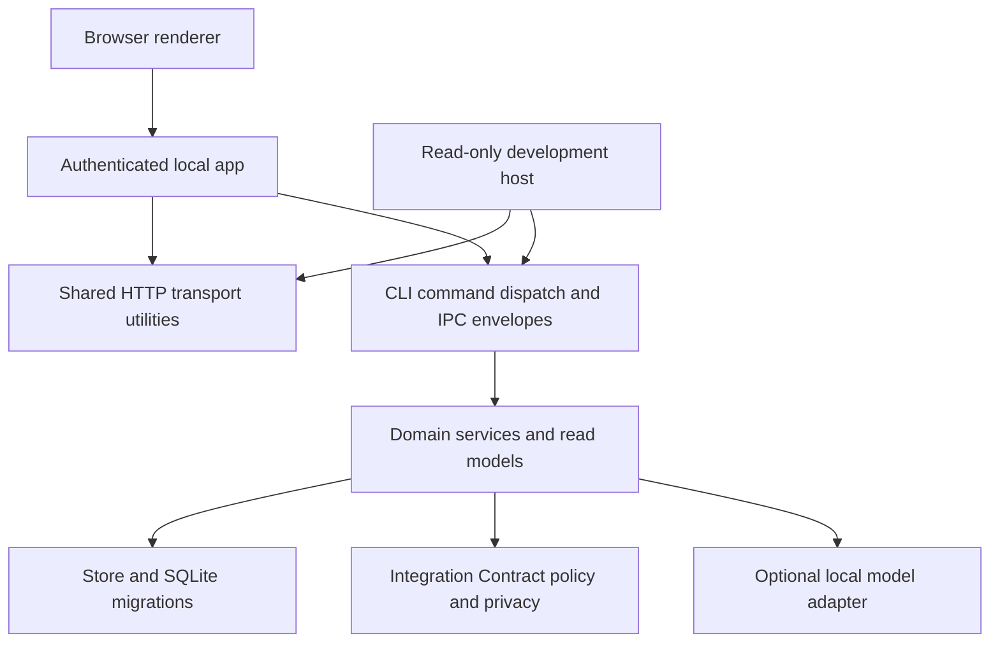

# Manager Edition architecture review

The local-first architecture remains appropriate for the personal pilot:
one durable workspace, backend policy decisions, bounded optional AI, and
an untrusted renderer. This review improves the dependency between hosts
and their shared transport utilities within accepted ADRs 0001–0004.
It does not authorize a release or change the blocked build steps.

## Dependencies and responsibilities

`app.py` owns the launch token, Host/Origin checks, allowed methods,
browser write capabilities, owner binding, onboarding, scheduler, and
instance lifetime. `devhost.py` owns its development-only read boundary.
Both use `http_transport.py` for renderer assets, response headers, and
validated read-command argument translation. That module never executes
commands, opens a workspace, or authenticates a request.

`cli.py` is currently both terminal parsing and the in-process command
dispatcher. Every dispatch opens and closes its own workspace; request
threads and the scheduler do not share a SQLite connection. HTTP adapters
invoke `cli.run` without redirecting global stdout. IPC data types live in
the schema, command map, and generated renderer declarations.

The domain modules must not import either host, HTTP transport utilities,
or CLI parsing. `test_architecture.py` guards those imports. The public
CLI remains a wider capability surface than the browser app: adding a
command to the CLI does not grant the browser access to it.

## Findings and improvements

| Finding | Consequence | Resolution |
|---|---|---|
| Production app imported helpers and a capability list from the development host | Packaging and production transport depended on development tooling; shared responsibilities had no independent home | Move the existing helpers to `http_transport.py`; keep development helper imports available for existing callers |
| Read argument translation relied on callers to reject write commands | Reusing the helper without its host guard could construct arguments for a write | Translator now refuses any command outside the explicit read allowlist; tests cover every other CLI command |
| README still described a headless G2 core | Readers could not reconcile the architecture with the implemented local app and packaging | Update status and module layout to match the current implementation |

Host-level checks remain required even though the translator now rejects
writes. It is an argument translator, not an authorization service. The
existing real-HTTP tests verify tokens, Host/Origin, methods, write
allowlists, path containment, security headers, and envelope equivalence.

## Important flows to preserve

1. A browser read passes its host's access checks, read-command allowlist,
   and argument validation before dispatch. A write passes the local app's
   token, origin, method, body checks, and separate write allowlist, then
   receives the owner identity from the workspace rather than the page.
2. Domain services apply capture rules and record changes in transactions.
   Brief acceptance and effects remain bound to the reviewed content hash;
   EDENA policy and receipt/reconciliation rules stay in backend services.
3. AI requests require the reviewed preview, policy and budget checks,
   a ledger entry before sending, and response/stop checks afterwards.
   The send handshake deliberately holds a write transaction until the
   provider signals that the request left or failed, ordering sends against
   stop changes. Waiting for the model's answer happens after that lock is
   released. Preserve this ordering and the bounded local connect timeout
   when changing provider transport; do not hold the lock for generation.
4. Upgrades require a backup before migrations. Repair moves forward;
   restore refuses silent loss of newer records. Updates remain advisory,
   signature-checked, and unconfigured until the steward supplies the key
   and hosting inputs.

## Follow-up priorities

**Storage portability is limited today.** Domain services and read models
issue SQL directly through `ws.store.conn`. `Store` centralizes connection,
transaction, migration, backup, and restore mechanics; it is not a complete
database-independent repository interface. ADR 0001's managed-database
direction would require explicit record/query ports and contract tests,
not merely replacing the connection. Keep SQLite for the pilot; define
those ports when an authorized second storage backend creates the need.

**Command parsing and dispatch share a module.** The current in-process
reuse avoids subprocesses and keeps one envelope implementation, but makes
HTTP hosts depend on argparse. If another host is implemented, extract a
typed command dispatcher first, leaving terminal and HTTP parsing in their
adapters. Preserve the IPC schema and service-level owner/hash checks;
do not create an alternative business-rule implementation in each host.

**Assistant orchestration is a large module.** Provider transport, preview
construction, budget reservation, stop checks, and answer retention have
different responsibilities. A future provider implementation should split
its HTTP transport from orchestration, with existing real-HTTP, stale
preview, budget, and stop-race tests as the acceptance criteria. Provider
selection remains a steward decision; this review adds no cloud path.

These are review recommendations, not new accepted ADRs. The immediate
change is intentionally confined to the shared HTTP boundary and its
read-command validation.

## Verification

`python3 -m unittest discover -s nurse-manager/tests -p 'test_*.py'`
ran 393 tests successfully (4 skipped). This includes real-HTTP host
boundaries, the app self-test, domain journeys, and the new dependency
and command-capability guards. Compilation, `git diff --check`, and the
public-artifact scan of the new transport module and this report passed.
Packaged binaries and browser visual checks were not run for this change.

The first full run exposed a synchronization race in an existing stop
test: the mock provider's start event preceded the send transaction's
commit. Both affected tests now wait, with a five-second failure deadline,
for the request to become visible from the observing connection before
asserting its title. Stop timing and late-reply assertions remain intact.
The full suite passed after that test correction.
